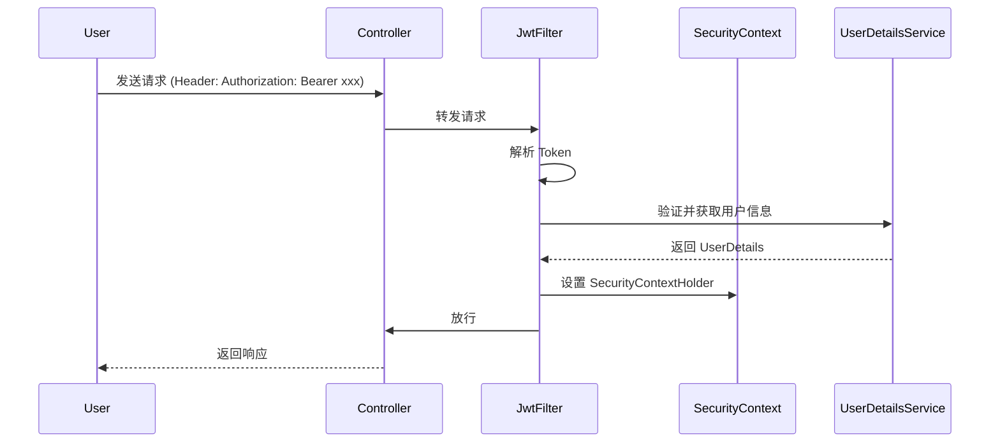

# mall 电商系统 - 架构设计文档

> 本文档是 mall 项目的核心架构文档，记录了项目的所有架构决策、设计细节和实现规范。基于本文档可以完整重建项目。

---

## 一、项目概览

### 1.1 项目信息

| 属性 | 值 |
|------|-----|
| 项目名称 | mall |
| 项目类型 | 电商系统（前后台分离） |
| 源码 | https://github.com/macrozheng/mall |
| 技术栈 | Spring Boot + MyBatis + MySQL + Redis + ES + RabbitMQ |
| 架构模式 | 模块化单体架构 |
| 代码规模 | 约 500+ Java 文件 |

### 1.2 模块结构

```
mall (Maven 父项目)
├── pom.xml                    # 父 POM，定义版本管理
├── mall-common/               # 公共模块
├── mall-mbg/                 # MyBatis 代码生成模块
├── mall-security/             # 安全模块（JWT + Spring Security）
├── mall-demo/                # 示例模块
├── mall-admin/               # 后台管理系统 (端口: 8080)
├── mall-search/              # 搜索服务 (端口: 8081)
└── mall-portal/             # 前台商城系统 (端口: 8085)
```

---

## 二、技术架构

### 2.1 技术栈明细

```yaml
核心框架:
  Spring Boot: 2.7.5
  Spring Framework: 5.3.23

数据层:
  MyBatis: 3.5.10
  MyBatis Generator: 1.4.1
  Druid: 1.2.14
  MySQL: 8.0.29
  Redis: (客户端 Hutool)
  Elasticsearch: 7.x

缓存与消息:
  Redis: 缓存层
  RabbitMQ: 消息队列

认证与安全:
  JWT: 0.9.1
  Spring Security: 5.7.x

其他:
  Swagger: 3.0.0 (springfox)
  Lombok: 自动生成 getter/setter
  Hutool: 5.8.9 工具集
  MinIO: 8.4.5 对象存储
  Alipay: 4.38.61.ALL 支付宝SDK
```

### 2.2 依赖关系图

```
┌─────────────────────────────────────────────────────────────┐
│                      mall-admin / mall-portal               │
│                  (业务模块，依赖下方所有模块)               │
└──────────────────────────┬──────────────────────────────────┘
                           │
         ┌─────────────────┼─────────────────┐
         ▼                 ▼                 ▼
┌─────────────────┐ ┌─────────────────┐ ┌─────────────────┐
│  mall-security │ │  mall-common   │ │   mall-mbg     │
│   (安全认证)    │ │   (公共代码)    │ │  (自动生成)    │
└────────┬────────┘ └────────┬────────┘ └─────────────────┘
         │                  │
         ▼                  ▼
┌─────────────────────────────────────────────────────────────┐
│                    第三方依赖                              │
│  Spring Boot / MyBatis / MySQL / Redis / ES / RabbitMQ    │
└─────────────────────────────────────────────────────────────┘
```

---

## 三、模块详细设计

### 3.1 mall-common 公共模块

**职责**：提供全局通用的工具类、响应封装、异常处理

```
mall-common/src/main/java/com/macro/mall/common/
├── api/
│   ├── CommonResult.java          # 统一响应封装
│   ├── CommonPage.java            # 分页封装
│   └── IErrorCode.java           # 错误码接口
├── exception/
│   ├── ApiException.java          # API 异常
│   ├── Asserts.java               # 断言工具
│   └── GlobalExceptionHandler.java # 全局异常处理
└── constant/
    └── Constants.java            # 常量定义
```

**核心代码 - CommonResult.java**：
```java
public class CommonResult<T> {
    private long code;
    private String message;
    private T data;

    public static <T> CommonResult<T> success(T data) {
        return success(data, "操作成功");
    }

    public static <T> CommonResult<T> success(T data, String message) {
        CommonResult<T> result = new CommonResult<>();
        result.code = 200;
        result.message = message;
        result.data = data;
        return result;
    }

    public static <T> CommonResult<T> failed() {
        return failed("操作失败");
    }

    public static <T> CommonResult<T> failed(String message) {
        CommonResult<T> result = new CommonResult<>();
        result.code = 500;
        result.message = message;
        return result;
    }
}
```

### 3.2 mall-security 安全模块

**职责**：JWT 认证、Spring Security 配置、动态权限

```
mall-security/src/main/java/com/macro/mall/
├── config/
│   ├── SecurityConfig.java           # Spring Security 配置
│   ├── JwtTokenUtil.java             # JWT 工具类
│   └── ResourceServerConfig.java    # 资源服务器配置
├── component/
│   ├── JwtAuthenticationTokenFilter.java  # JWT 过滤器
│   ├── JwtAuthenticationEntryPoint.java    # 认证失败处理
│   ├── DynamicSecurityService.java         # 动态权限
│   └── JwtTokenComponent.java             # Token 组件
└── dto/
    ├── AdminUserDetails.java          # 管理员用户详情
    └── JwtToken.java                  # Token 对象
```

**安全流程**：


**JWT 配置参数**：
```yaml
jwt:
  secret: mall-admin-secret
  expiration: 604800  # 7天过期
  token-header: Authorization
  token-prefix: Bearer
```

### 3.3 mall-mbg 代码生成模块

**职责**：基于 MyBatis Generator 自动生成 Entity、Mapper、DAO

```
mall-mbg/src/main/java/com/macro/mall/
├── model/                    # 实体类 (示例)
│   ├── PmsBrand.java         # 品牌实体
│   ├── PmsProduct.java       # 商品实体
│   ├── OmsOrder.java         # 订单实体
│   └── UmsAdmin.java         # 管理员实体
├── mapper/                   # Mapper 接口
│   ├── PmsBrandMapper.java
│   ├── PmsProductMapper.java
│   └── OmsOrderMapper.java
└── mapper.xml/              # Mapper XML
    ├── PmsBrandMapper.xml
    ├── PmsProductMapper.xml
    └── OmsOrderMapper.xml
```

**Generator 配置 (generator.properties)**：
```properties
# 包配置
package.model=com.macro.mall.model
package.mapper=com.macro.mall.mapper
package.dao=com.macro.mall.dao

# 数据库配置
jdbc.driver=com.mysql.cj.jdbc.Driver
jdbc.url=jdbc:mysql://localhost:3306/mall
jdbc.user=root
jdbc.password=root

# 表配置
tables=ums_admin,ums_role,pms_brand,pms_product,oms_order
```

**生成的 Entity 示例 - PmsBrand.java**：
```java
@Data
@EqualsAndHashCode(callSuper = false)
public class PmsBrand {
    private Long id;

    private String name;

    @JsonProperty("firstLetter")
    private String firstLetter;

    private String logo;

    private String bigPic;

    private String story;

    private Integer productCount;

    private Integer productCommentCount;

    private Integer sort;

    @JsonProperty("showStatus")
    private Integer showStatus;

    private Date createTime;

    private Date updateTime;
}
```

### 3.4 mall-admin 后台管理系统

**职责**：后台管理 API，包含商品、订单、会员、营销、内容、权限管理

#### 3.4.1 包结构

```
mall-admin/src/main/java/com/macro/mall/
├── MallAdminApplication.java         # 启动类
├── config/                           # 配置
│   ├── SwaggerConfig.java            # Swagger 配置
│   ├── MyBatisConfig.java           # MyBatis 配置
│   ├── CorsConfig.java               # 跨域配置
│   ├── MallSecurityConfig.java       # 安全配置
│   └── OssConfig.java                # OSS 配置
├── controller/                       # 控制层 (按模块划分)
│   ├── PmsBrandController.java       # 品牌管理
│   ├── PmsProductController.java     # 商品管理
│   ├── PmsProductCategoryController.java  # 分类管理
│   ├── OmsOrderController.java       # 订单管理
│   ├── OmsOrderReturnApplyController.java  # 退货管理
│   ├── UmsAdminController.java       # 管理员
│   ├── UmsRoleController.java        # 角色
│   ├── UmsMenuController.java        # 菜单
│   ├── SmsCouponController.java      # 优惠券
│   ├── SmsFlashPromotionController.java  # 秒杀
│   ├── CmsSubjectController.java     # 专题
│   └── OssController.java            # 文件上传
├── service/                          # 业务层
│   ├── PmsBrandService.java         # 品牌服务接口
│   ├── impl/
│   │   └── PmsBrandServiceImpl.java  # 品牌服务实现
│   └── *.java
├── dao/                              # 数据访问
│   ├── PmsBrandDao.java
│   └── *.java
├── dto/                              # 数据传输对象
│   ├── PmsBrandParam.java            # 请求参数
│   ├── PmsProductQueryParam.java    # 查询参数
│   └── *.java
└── bean/                             # 业务对象
    └── AdminUserDetails.java
```

#### 3.4.2 Controller 命名规范

| 模块 | Controller | Service | DAO | 表前缀 |
|------|-----------|---------|-----|--------|
| 商品品牌 | PmsBrandController | PmsBrandService | PmsBrandDao | pms_brand |
| 商品 | PmsProductController | PmsProductService | PmsProductDao | pms_product |
| 订单 | OmsOrderController | OmsOrderService | OmsOrderDao | oms_order |
| 会员 | UmsMemberController | UmsMemberService | UmsMemberDao | ums_member |
| 优惠券 | SmsCouponController | SmsCouponService | SmsCouponDao | sms_coupon |

#### 3.4.3 API 路由规范

```
# 路由格式
/restful 风格
/api/{模块名}/{操作}

# 示例
GET    /brand/listAll           # 获取全部品牌
GET    /brand/list              # 分页查询品牌
POST   /brand/create            # 创建品牌
POST   /brand/update/{id}       # 更新品牌
GET    /brand/delete/{id}      # 删除品牌
POST   /brand/delete/batch     # 批量删除

# 订单相关
GET    /order/list              # 订单列表
GET    /order/{id}             # 订单详情
POST   /order/delivery         # 发货
POST   /order/close            # 关闭订单
POST   /order/delete           # 删除订单
```

### 3.5 mall-search 搜索服务

**职责**：基于 Elasticsearch 的商品搜索

```
mall-search/src/main/java/com/macro/mall/
├── config/
│   └── ElasticsearchConfig.java    # ES 配置
├── document/
│   └── EsProduct.java             # ES 文档模型
├── repository/
│   └── EsProductRepository.java   # ES 仓储
├── service/
│   ├── EsProductService.java      # ES 服务
│   └── ProductSearchService.java # 搜索服务
└── controller/
    └── SearchController.java       # 搜索接口
```

**ES 索引结构 - EsProduct**：
```java
@Document(indexName = "product")
public class EsProduct {
    @Id
    private Long id;

    @Field(type = FieldType.Text, analyzer = "ik_max_word")
    private String name;

    @Field(type = FieldType.Keyword)
    private String productSn;

    @Field(type = FieldType.Double)
    private Double price;

    @Field(type = FieldType.Integer)
    private Integer stock;

    @Field(type = FieldType.Text, analyzer = "ik_max_word")
    private String description;
}
```

### 3.6 mall-portal 前台商城

**职责**：用户端 API，商品浏览、购物车、订单、会员中心

```
mall-portal/src/main/java/com/macro/mall/
├── component/
│   ├── AuthManager.java           # 认证管理
│   ├── CartService.java          # 购物车服务
│   └── OrderService.java         # 订单服务
├── controller/
│   ├── MemberController.java     # 会员
│   ├── ProductController.java    # 商品
│   ├── CartController.java       # 购物车
│   ├── OrderController.java      # 订单
│   └── HomeController.java       # 首页
└── service/
    ├── MemberService.java
    └── OrderService.java
```

---

## 四、数据库设计

### 4.1 数据库命名规范

| 前缀 | 模块 | 说明 |
|------|------|------|
| ums_ | 用户模块 | User Management System |
| pms_ | 商品模块 | Product Management System |
| oms_ | 订单模块 | Order Management System |
| sms_ | 营销模块 | Sales Management System |
| cms_ | 内容模块 | Content Management System |

### 4.2 核心表结构

#### 4.2.1 用户模块 (ums_)

**ums_admin - 管理员表**：
```sql
CREATE TABLE ums_admin (
    id BIGINT PRIMARY KEY AUTO_INCREMENT,
    username VARCHAR(64) NOT NULL UNIQUE,
    password VARCHAR(64) NOT NULL,
    icon VARCHAR(500),
    email VARCHAR(100),
    nick_name VARCHAR(200),
    note VARCHAR(500),
    create_time DATETIME,
    login_time DATETIME,
    status INT DEFAULT 1 COMMENT '0-禁用 1-启用'
);
```

**ums_role - 角色表**：
```sql
CREATE TABLE ums_role (
    id BIGINT PRIMARY KEY AUTO_INCREMENT,
    name VARCHAR(100) NOT NULL,
    description VARCHAR(500),
    admin_count INT DEFAULT 0,
    create_time DATETIME,
    status INT DEFAULT 1,
    sort INT DEFAULT 0
);
```

**ums_resource - 资源表**：
```sql
CREATE TABLE ums_resource (
    id BIGINT PRIMARY KEY AUTO_INCREMENT,
    create_time DATETIME,
    name VARCHAR(200) NOT NULL,
    url VARCHAR(200),
    description VARCHAR(500),
    category_id BIGINT
);
```

#### 4.2.2 商品模块 (pms_)

**pms_brand - 品牌表**：
```sql
CREATE TABLE pms_brand (
    id BIGINT PRIMARY KEY AUTO_INCREMENT,
    name VARCHAR(100) NOT NULL,
    first_letter VARCHAR(8),
    logo VARCHAR(255),
    big_pic VARCHAR(255),
    story VARCHAR(1000),
    product_count INT DEFAULT 0,
    product_comment_count INT DEFAULT 0,
    sort INT DEFAULT 0,
    show_status INT DEFAULT 1,
    create_time DATETIME,
    update_time DATETIME
);
```

**pms_product - 商品表**：
```sql
CREATE TABLE pms_product (
    id BIGINT PRIMARY KEY AUTO_INCREMENT,
    brand_id BIGINT,
    product_category_id BIGINT,
    name VARCHAR(200) NOT NULL,
    pic VARCHAR(255),
    product_sn VARCHAR(64) NOT NULL UNIQUE,
    price DECIMAL(10,2),
    stock INT DEFAULT 0,
    sale INT DEFAULT 0,
    description TEXT,
    publish_status INT DEFAULT 0,
    verify_status INT DEFAULT 0,
    create_time DATETIME,
    update_time DATETIME
);
```

**pms_sku_stock - SKU 库存表**：
```sql
CREATE TABLE pms_sku_stock (
    id BIGINT PRIMARY KEY AUTO_INCREMENT,
    product_id BIGINT NOT NULL,
    sku_code VARCHAR(64) NOT NULL UNIQUE,
    price DECIMAL(10,2),
    stock INT DEFAULT 0,
    low_stock INT DEFAULT 0,
    pic VARCHAR(255),
    sale INT DEFAULT 0,
    promotion_price DECIMAL(10,2)
);
```

**pms_product_category - 商品分类表**：
```sql
CREATE TABLE pms_product_category (
    id BIGINT PRIMARY KEY AUTO_INCREMENT,
    parent_id BIGINT DEFAULT 0,
    name VARCHAR(200),
    level INT DEFAULT 1,
    product_count INT DEFAULT 0,
    nav_status INT DEFAULT 0,
    show_status INT DEFAULT 0,
    sort INT DEFAULT 0,
    icon VARCHAR(255),
    keywords VARCHAR(500),
    description TEXT
);
```

#### 4.2.3 订单模块 (oms_)

**oms_order - 订单表**：
```sql
CREATE TABLE oms_order (
    id BIGINT PRIMARY KEY AUTO_INCREMENT,
    member_id BIGINT,
    member_username VARCHAR(64),
    order_sn VARCHAR(64) UNIQUE,
    total_amount DECIMAL(10,2),
    pay_amount DECIMAL(10,2),
    freight_amount DECIMAL(10,2) DEFAULT 0,
    status INT DEFAULT 0,
    delivery_company VARCHAR(64),
    delivery_sn VARCHAR(64),
    receiver_phone VARCHAR(32),
    receiver_post_code VARCHAR(32),
    receiver_province VARCHAR(32),
    receiver_city VARCHAR(32),
    receiver_region VARCHAR(32),
    receiver_detail_address VARCHAR(200),
    note VARCHAR(500),
    confirm_status INT DEFAULT 0,
    delete_status INT DEFAULT 0,
    create_time DATETIME,
    delivery_time DATETIME,
    receive_time DATETIME,
    comment_time DATETIME
);
```

**oms_order_item - 订单项表**：
```sql
CREATE TABLE oms_order_item (
    id BIGINT PRIMARY KEY AUTO_INCREMENT,
    order_id BIGINT,
    order_sn VARCHAR(64),
    product_id BIGINT,
    product_pic VARCHAR(255),
    product_name VARCHAR(200),
    product_brand VARCHAR(200),
    product_sn VARCHAR(64),
    price DECIMAL(10,2),
    product_quantity INT,
    sku_id BIGINT,
    sku_code VARCHAR(64),
    sp1 VARCHAR(100),
    sp2 VARCHAR(100),
    promotion_amount DECIMAL(10,2),
    coupon_amount DECIMAL(10,2)
);
```

#### 4.2.4 营销模块 (sms_)

**sms_coupon - 优惠券表**：
```sql
CREATE TABLE sms_coupon (
    id BIGINT PRIMARY KEY AUTO_INCREMENT,
    type INT DEFAULT 0 COMMENT '0-全场券 1-会员券 2-商品券 3-订单券',
    name VARCHAR(100) NOT NULL,
    amount DECIMAL(10,2),
    min_point DECIMAL(10,2),
    start_time DATETIME,
    end_time DATETIME,
    use_type INT DEFAULT 0,
    use_limit INT DEFAULT 1,
    use_count INT DEFAULT 0,
    receive_count INT DEFAULT 0,
    enable_time DATETIME,
    publish_count INT DEFAULT 0,
    status INT DEFAULT 0,
    create_time DATETIME
);
```

**sms_flash_promotion - 秒杀活动表**：
```sql
CREATE TABLE sms_flash_promotion (
    id BIGINT PRIMARY KEY AUTO_INCREMENT,
    title VARCHAR(200) NOT NULL,
    start_date DATE NOT NULL,
    end_date DATE NOT NULL,
    status INT DEFAULT 0,
    create_time DATETIME
);
```

### 4.3 索引设计

```sql
-- 管理员表索引
CREATE INDEX idx_username ON ums_admin(username);
CREATE INDEX idx_create_time ON ums_admin(create_time);

-- 商品表索引
CREATE INDEX idx_brand_id ON pms_product(brand_id);
CREATE INDEX idx_category_id ON pms_product(product_category_id);
CREATE INDEX idx_product_sn ON pms_product(product_sn);
CREATE INDEX idx_name ON pms_product(name);

-- 订单表索引
CREATE INDEX idx_member_id ON oms_order(member_id);
CREATE INDEX idx_order_sn ON oms_order(order_sn);
CREATE INDEX idx_create_time ON oms_order(create_time);
CREATE INDEX idx_status ON oms_order(status);
```

---

## 五、API 接口规范

### 5.1 响应格式

```json
// 成功响应
{
  "code": 200,
  "message": "操作成功",
  "data": { }
}

// 分页响应
{
  "code": 200,
  "message": "操作成功",
  "data": {
    "list": [],
    "totalCount": 100,
    "pageNum": 1,
    "pageSize": 5
  }
}

// 错误响应
{
  "code": 500,
  "message": "系统错误",
  "data": null
}
```

### 5.2 错误码规范

| 错误码 | 说明 |
|--------|------|
| 200 | 成功 |
| 400 | 请求参数错误 |
| 401 | 未授权 (Token 无效) |
| 403 | 禁止访问 (无权限) |
| 404 | 资源不存在 |
| 500 | 服务器内部错误 |

### 5.3 常用接口列表

#### 商品管理接口

| 接口 | 方法 | 路径 | 说明 |
|------|------|------|------|
| 品牌列表 | GET | /brand/listAll | 获取全部品牌 |
| 品牌分页 | GET | /brand/list | 分页查询品牌 |
| 创建品牌 | POST | /brand/create | 创建品牌 |
| 更新品牌 | POST | /brand/update/{id} | 更新品牌 |
| 删除品牌 | GET | /brand/delete/{id} | 删除品牌 |
| 分类树 | GET | /productCategory/listWithTree | 获取分类树 |

#### 订单管理接口

| 接口 | 方法 | 路径 | 说明 |
|------|------|------|------|
| 订单列表 | GET | /order/list | 订单列表 |
| 订单详情 | GET | /order/{id} | 订单详情 |
| 发货 | POST | /order/delivery | 发货 |
| 关闭订单 | POST | /order/close | 关闭订单 |
| 删除订单 | POST | /order/delete | 删除订单 |

#### 会员管理接口

| 接口 | 方法 | 路径 | 说明 |
|------|------|------|------|
| 会员列表 | GET | /member/list | 会员列表 |
| 禁用/启用 | POST | /member/update/status | 修改状态 |

---

## 六、开发规范

### 6.1 代码分层规范

```
controller/     # 职责：参数校验、调用 Service、返回响应
                # 禁止：业务逻辑、数据库访问
                # 注解：@Controller, @RequestMapping, @ApiOperation

service/       # 职责：业务逻辑、事务管理
                # 禁止：直接 HTTP 请求
                # 注解：@Service, @Transactional

dao/           # 职责：数据访问、SQL 执行
                # 禁止：业务逻辑
                # 注解：@Mapper

dto/           # 职责：请求参数封装、响应数据封装
                # 命名：*Param, *QueryParam, *Result
```

### 6.2 命名规范

| 类型 | 规范 | 示例 |
|------|------|------|
| Controller | {模块}Controller.java | PmsBrandController |
| Service | {模块}Service.java | PmsBrandService |
| ServiceImpl | {模块}ServiceImpl.java | PmsBrandServiceImpl |
| DAO | {模块}Dao.java | PmsBrandDao |
| Entity | {模块}.java | PmsBrand |
| DTO | {模块}Param.java | PmsBrandParam |
| 表名 | {模块前缀}_{实体} | pms_brand |

### 6.3 RESTful 规范

```java
// 查询 - GET
GET    /resource              # 列表
GET    /resource/{id}         # 详情

// 创建 - POST
POST   /resource              # 创建

// 更新 - POST 或 PUT
POST   /resource/{id}        # 更新 (推荐)
PUT    /resource/{id}        # 更新

// 删除 - DELETE 或 POST
DELETE /resource/{id}        # 删除 (推荐)
POST   /resource/delete/{id} # 删除 (某些场景)
```

---

## 七、配置文件

### 7.1 application.yml 配置结构

```yaml
server:
  port: 8080
  servlet:
    context-path: /admin

spring:
  application:
    name: mall-admin
  datasource:
    driver-class-name: com.mysql.cj.jdbc.Driver
    url: jdbc:mysql://localhost:3306/mall?useUnicode=true&characterEncoding=utf-8
    username: root
    password: root
  redis:
    host: localhost
    port: 6379

mybatis:
  mapper-locations:
    - classpath:mapper/*.xml
  type-aliases-package: com.macro.mall.model

jwt:
  secret: mall-admin-secret
  expiration: 604800
  token-header: Authorization
  token-prefix: Bearer

springfox:
  swagger:
    title: mall-admin API
    version: 1.0.0
```

---

## 八、可逆生成指南

> 基于本文档可以完整重建 mall 项目，按以下步骤操作：

### 8.1 创建 Maven 父项目

```xml
<!-- pom.xml -->
<project>
    <modelVersion>4.0.0</modelVersion>
    <groupId>com.macro.mall</groupId>
    <artifactId>mall</artifactId>
    <version>1.0-SNAPSHOT</version>
    <packaging>pom</packaging>

    <parent>
        <groupId>org.springframework.boot</groupId>
        <artifactId>spring-boot-starter-parent</artifactId>
        <version>2.7.5</version>
    </parent>

    <modules>
        <module>mall-common</module>
        <module>mall-mbg</module>
        <module>mall-security</module>
        <module>mall-admin</module>
    </modules>
</project>
```

### 8.2 创建子模块

按以下顺序创建：
1. mall-common（公共模块）
2. mall-mbg（代码生成）
3. mall-security（安全模块）
4. mall-admin（后台管理）
5. mall-portal（前台商城）
6. mall-search（搜索服务）

### 8.3 代码生成

使用 mall-mbg 模块的 MyBatis Generator 生成基础代码。

---

## 九、总结

本文档记录了 mall 电商系统的完整架构设计，包含：

| 章节 | 内容 |
|------|------|
| 项目概览 | 模块结构、技术栈 |
| 技术架构 | 依赖关系、技术选型 |
| 模块设计 | 各模块职责、代码结构 |
| 数据库设计 | 表结构、索引、命名规范 |
| API 规范 | 响应格式、错误码、接口列表 |
| 开发规范 | 代码分层、命名、RESTful |
| 配置说明 | application.yml 结构 |
| 可逆生成 | 基于文档重建项目指南 |

**基于本文档可以完整重建整个 mall 项目。**
