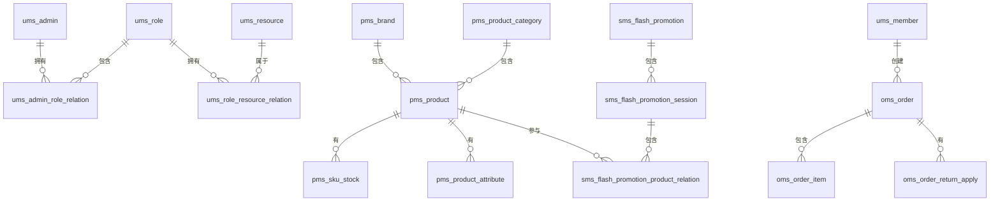

# mall 电商系统 - 数据库设计文档

> 本文档记录了 mall 项目完整的数据库设计，包含所有表的字段、索引、ER 关系，可基于本文档重建数据库。

---

## 一、数据库概览

### 1.1 数据库信息

| 属性 | 值 |
|------|-----|
| 数据库名 | mall |
| 字符集 | utf8mb4 |
| 排序规则 | utf8mb4_unicode_ci |
| 存储引擎 | InnoDB |

### 1.2 表清单

| 前缀 | 模块 | 表数量 | 说明 |
|------|------|--------|------|
| ums_ | 用户模块 | 8 | 管理员、角色、权限、菜单 |
| pms_ | 商品模块 | 12 | 品牌、分类、属性、商品、SKU |
| oms_ | 订单模块 | 10 | 订单、退货、购物车 |
| sms_ | 营销模块 | 12 | 优惠券、秒杀、活动 |
| cms_ | 内容模块 | 4 | 专题、优选区、帮助 |

---

## 二、用户模块 (ums_)

### 2.1 ums_admin - 管理员表

```sql
CREATE TABLE `ums_admin` (
  `id` bigint NOT NULL AUTO_INCREMENT COMMENT '主键',
  `username` varchar(64) NOT NULL COMMENT '用户名',
  `password` varchar(64) NOT NULL COMMENT '密码',
  `icon` varchar(500) DEFAULT NULL COMMENT '头像',
  `email` varchar(100) DEFAULT NULL COMMENT '邮箱',
  `nick_name` varchar(200) DEFAULT NULL COMMENT '昵称',
  `note` varchar(500) DEFAULT NULL COMMENT '备注',
  `create_time` datetime DEFAULT NULL COMMENT '创建时间',
  `login_time` datetime DEFAULT NULL COMMENT '最后登录时间',
  `status` int DEFAULT '1' COMMENT '账号状态：0->禁用；1->启用',
  PRIMARY KEY (`id`),
  UNIQUE KEY `idx_username` (`username`)
) ENGINE=InnoDB DEFAULT CHARSET=utf8mb4 COMMENT='管理员表';
```

### 2.2 ums_role - 角色表

```sql
CREATE TABLE `ums_role` (
  `id` bigint NOT NULL AUTO_INCREMENT,
  `name` varchar(100) NOT NULL COMMENT '角色名称',
  `description` varchar(500) DEFAULT NULL COMMENT '角色描述',
  `admin_count` int DEFAULT NULL COMMENT '后台用户数量',
  `create_time` datetime DEFAULT NULL COMMENT '创建时间',
  `status` int DEFAULT '1' COMMENT '启用状态：0->禁用；1->启用',
  `sort` int DEFAULT '0' COMMENT '排序',
  PRIMARY KEY (`id`)
) ENGINE=InnoDB DEFAULT CHARSET=utf8mb4 COMMENT='角色表';
```

### 2.3 ums_admin_role_relation - 管理员角色关联表

```sql
CREATE TABLE `ums_admin_role_relation` (
  `id` bigint NOT NULL AUTO_INCREMENT,
  `admin_id` bigint NOT NULL,
  `role_id` bigint NOT NULL,
  PRIMARY KEY (`id`)
) ENGINE=InnoDB DEFAULT CHARSET=utf8mb4 COMMENT='管理员和角色关联表';
```

### 2.4 ums_resource - 资源表

```sql
CREATE TABLE `ums_resource` (
  `id` bigint NOT NULL AUTO_INCREMENT,
  `create_time` datetime DEFAULT NULL COMMENT '创建时间',
  `name` varchar(200) NOT NULL COMMENT '资源名称',
  `url` varchar(200) NOT NULL COMMENT '资源URL',
  `description` varchar(500) DEFAULT NULL COMMENT '资源描述',
  `category_id` bigint DEFAULT NULL COMMENT '资源分类ID',
  PRIMARY KEY (`id`)
) ENGINE=InnoDB DEFAULT CHARSET=utf8mb4 COMMENT='后台资源表';
```

### 2.5 ums_role_resource_relation - 角色资源关联表

```sql
CREATE TABLE `ums_role_resource_relation` (
  `id` bigint NOT NULL AUTO_INCREMENT,
  `role_id` bigint NOT NULL,
  `resource_id` bigint NOT NULL,
  PRIMARY KEY (`id`)
) ENGINE=InnoDB DEFAULT CHARSET=utf8mb4 COMMENT='角色和资源关联表';
```

---

## 三、商品模块 (pms_)

### 3.1 pms_brand - 品牌表

```sql
CREATE TABLE `pms_brand` (
  `id` bigint NOT NULL AUTO_INCREMENT,
  `name` varchar(100) NOT NULL COMMENT '品牌名称',
  `first_letter` varchar(8) DEFAULT NULL COMMENT '首字母',
  `logo` varchar(255) DEFAULT NULL COMMENT '品牌logo',
  `big_pic` varchar(255) DEFAULT NULL COMMENT '品牌大图',
  `story` varchar(1000) DEFAULT NULL COMMENT '品牌故事',
  `product_count` int DEFAULT '0' COMMENT '产品数量',
  `product_comment_count` int DEFAULT '0' COMMENT '产品评论数量',
  `sort` int DEFAULT '0' COMMENT '排序',
  `show_status` int DEFAULT '1' COMMENT '是否显示：0->不显示；1->显示',
  `create_time` datetime DEFAULT NULL,
  `update_time` datetime DEFAULT NULL,
  PRIMARY KEY (`id`)
) ENGINE=InnoDB DEFAULT CHARSET=utf8mb4 COMMENT='品牌表';
```

### 3.2 pms_product_category - 商品分类表

```sql
CREATE TABLE `pms_product_category` (
  `id` bigint NOT NULL AUTO_INCREMENT,
  `parent_id` bigint DEFAULT '0' COMMENT '上级分类的编号',
  `name` varchar(200) DEFAULT NULL COMMENT '分类名称',
  `level` int DEFAULT '1' COMMENT '分类级别：1->一级；2->二级；3->三级',
  `product_count` int DEFAULT '0' COMMENT '产品数量',
  `nav_status` int DEFAULT '0' COMMENT '是否显示在导航栏：0->不显示；1->显示',
  `show_status` int DEFAULT '1' COMMENT '显示状态：0->不显示；1->显示',
  `sort` int DEFAULT '0' COMMENT '排序',
  `icon` varchar(255) DEFAULT NULL COMMENT '分类图标',
  `keywords` varchar(500) DEFAULT NULL COMMENT '关键字',
  `description` varchar(1000) DEFAULT NULL COMMENT '描述',
  PRIMARY KEY (`id`),
  KEY `idx_parent_id` (`parent_id`)
) ENGINE=InnoDB DEFAULT CHARSET=utf8mb4 COMMENT='产品分类表';
```

### 3.3 pms_product - 商品表

```sql
CREATE TABLE `pms_product` (
  `id` bigint NOT NULL AUTO_INCREMENT,
  `brand_id` bigint DEFAULT NULL,
  `product_category_id` bigint DEFAULT NULL,
  `name` varchar(200) NOT NULL COMMENT '商品名称',
  `pic` varchar(255) DEFAULT NULL,
  `product_sn` varchar(64) NOT NULL COMMENT '商品编号',
  `price` decimal(10,2) DEFAULT NULL,
  `stock` int DEFAULT '0' COMMENT '库存',
  `sale` int DEFAULT '0' COMMENT '销量',
  `description` text COMMENT '商品描述',
  `publish_status` int DEFAULT '0' COMMENT '上架状态：0->下架；1->上架',
  `verify_status` int DEFAULT '0' COMMENT '审核状态：0->未审核；1->审核通过',
  `weight` decimal(10,2) DEFAULT NULL COMMENT '重量',
  `length` decimal(10,2) DEFAULT NULL COMMENT '长度',
  `width` decimal(10,2) DEFAULT NULL COMMENT '宽度',
  `height` decimal(10,2) DEFAULT NULL COMMENT '高度',
  `album_pics` varchar(2000) DEFAULT NULL COMMENT '画册图片',
  `detail_title` varchar(255) DEFAULT NULL,
  `detail_desc` varchar(500) DEFAULT NULL,
  `detail_html` text COMMENT '产品详情html',
  `create_time` datetime DEFAULT NULL,
  `update_time` datetime DEFAULT NULL,
  PRIMARY KEY (`id`),
  UNIQUE KEY `idx_product_sn` (`product_sn`),
  KEY `idx_brand_id` (`brand_id`),
  KEY `idx_category_id` (`product_category_id`),
  KEY `idx_name` (`name`)
) ENGINE=InnoDB DEFAULT CHARSET=utf8mb4 COMMENT='商品表';
```

### 3.4 pms_sku_stock - SKU 库存表

```sql
CREATE TABLE `pms_sku_stock` (
  `id` bigint NOT NULL AUTO_INCREMENT,
  `product_id` bigint NOT NULL COMMENT '商品ID',
  `sku_code` varchar(64) NOT NULL COMMENT 'SKU编码',
  `price` decimal(10,2) DEFAULT NULL,
  `stock` int DEFAULT '0' COMMENT '库存',
  `low_stock` int DEFAULT '0' COMMENT '预警库存',
  `pic` varchar(255) DEFAULT NULL,
  `sale` int DEFAULT '0' COMMENT '销量',
  `promotion_price` decimal(10,2) DEFAULT NULL COMMENT '促销价格',
  `lock_stock` int DEFAULT '0' COMMENT '锁定库存',
  `sp_data` varchar(2000) DEFAULT NULL COMMENT '销售属性',
  PRIMARY KEY (`id`),
  UNIQUE KEY `idx_sku_code` (`sku_code`),
  KEY `idx_product_id` (`product_id`)
) ENGINE=InnoDB DEFAULT CHARSET=utf8mb4 COMMENT='SKU库存表';
```

### 3.5 pms_product_attribute - 商品属性表

```sql
CREATE TABLE `pms_product_attribute` (
  `id` bigint NOT NULL AUTO_INCREMENT,
  `product_attribute_category_id` bigint NOT NULL COMMENT '属性分类ID',
  `name` varchar(200) DEFAULT NULL COMMENT '属性名称',
  `select_type` int DEFAULT '1' COMMENT '属性选择类型：0->唯一；1->单选；2->多选',
  `input_type` int DEFAULT '0' COMMENT '属性录入方式：0->手动录入；1->从列表中选择',
  `input_list` varchar(500) DEFAULT NULL COMMENT '可选值列表',
  `sort` int DEFAULT '0' COMMENT '排序字段',
  `filter_type` int DEFAULT '1' COMMENT '筛选类型：0->普通；1->颜色',
  `search_type` int DEFAULT '0' COMMENT '检索类型：0->不需要；1->关键字检索；2->范围检索',
  `related_status` int DEFAULT '0' COMMENT '相同属性产品是否关联：0->不关联；1->关联',
  `hand_add_status` int DEFAULT '0' COMMENT '是否支持手动新增：0->不支持；1->支持',
  `type` int DEFAULT '0' COMMENT '属性的类型：0->规格；1->属性',
  PRIMARY KEY (`id`)
) ENGINE=InnoDB DEFAULT CHARSET=utf8mb4 COMMENT='商品属性表';
```

---

## 四、订单模块 (oms_)

### 4.1 oms_order - 订单表

```sql
CREATE TABLE `oms_order` (
  `id` bigint NOT NULL AUTO_INCREMENT,
  `member_id` bigint DEFAULT NULL COMMENT '会员ID',
  `member_username` varchar(64) DEFAULT NULL COMMENT '会员用户名',
  `order_sn` varchar(64) DEFAULT NULL COMMENT '订单编号',
  `total_amount` decimal(10,2) DEFAULT NULL COMMENT '订单总金额',
  `pay_amount` decimal(10,2) DEFAULT NULL COMMENT '实付金额',
  `freight_amount` decimal(10,2) DEFAULT NULL COMMENT '运费金额',
  `status` int DEFAULT '0' COMMENT '订单状态：0->待付款；1->待发货；2->已发货；3->已完成；4->已关闭',
  `delivery_company` varchar(64) DEFAULT NULL COMMENT '物流公司',
  `delivery_sn` varchar(64) DEFAULT NULL COMMENT '物流单号',
  `receiver_phone` varchar(32) DEFAULT NULL COMMENT '收货人电话',
  `receiver_post_code` varchar(32) DEFAULT NULL COMMENT '收货人邮编',
  `receiver_province` varchar(32) DEFAULT NULL COMMENT '收货人省份',
  `receiver_city` varchar(32) DEFAULT NULL COMMENT '收货人城市',
  `receiver_region` varchar(32) DEFAULT NULL COMMENT '收货人区/县',
  `receiver_detail_address` varchar(200) DEFAULT NULL COMMENT '详细地址',
  `receiver_name` varchar(64) DEFAULT NULL COMMENT '收货人姓名',
  `note` varchar(500) DEFAULT NULL COMMENT '订单备注',
  `confirm_status` int DEFAULT '0' COMMENT '确认收货状态：0->未确认；1->已确认',
  `delete_status` int DEFAULT '0' COMMENT '删除状态：0->未删除；1->已删除',
  `create_time` datetime DEFAULT NULL COMMENT '下单时间',
  `delivery_time` datetime DEFAULT NULL COMMENT '发货时间',
  `receive_time` datetime DEFAULT NULL COMMENT '收货时间',
  `comment_time` datetime DEFAULT NULL COMMENT '评价时间',
  PRIMARY KEY (`id`),
  UNIQUE KEY `idx_order_sn` (`order_sn`),
  KEY `idx_member_id` (`member_id`),
  KEY `idx_create_time` (`create_time`),
  KEY `idx_status` (`status`)
) ENGINE=InnoDB DEFAULT CHARSET=utf8mb4 COMMENT='订单表';
```

### 4.2 oms_order_item - 订单项表

```sql
CREATE TABLE `oms_order_item` (
  `id` bigint NOT NULL AUTO_INCREMENT,
  `order_id` bigint DEFAULT NULL COMMENT '订单ID',
  `order_sn` varchar(64) DEFAULT NULL COMMENT '订单编号',
  `product_id` bigint DEFAULT NULL,
  `product_pic` varchar(255) DEFAULT NULL,
  `product_name` varchar(200) DEFAULT NULL COMMENT '商品名称',
  `product_brand` varchar(200) DEFAULT NULL,
  `product_sn` varchar(64) DEFAULT NULL,
  `price` decimal(10,2) DEFAULT NULL COMMENT '单价',
  `product_quantity` int DEFAULT NULL COMMENT '数量',
  `sku_id` bigint DEFAULT NULL,
  `sku_code` varchar(64) DEFAULT NULL COMMENT 'SKU编码',
  `sp1` varchar(100) DEFAULT NULL COMMENT '商品销售属性1',
  `sp2` varchar(100) DEFAULT NULL COMMENT '商品销售属性2',
  `promotion_amount` decimal(10,2) DEFAULT NULL COMMENT '促销优惠金额',
  `coupon_amount` decimal(10,2) DEFAULT NULL COMMENT '优惠券优惠金额',
  PRIMARY KEY (`id`),
  KEY `idx_order_id` (`order_id`),
  KEY `idx_order_sn` (`order_sn`)
) ENGINE=InnoDB DEFAULT CHARSET=utf8mb4 COMMENT='订单项表';
```

### 4.3 oms_order_return_apply - 退货申请表

```sql
CREATE TABLE `oms_order_return_apply` (
  `id` bigint NOT NULL AUTO_INCREMENT,
  `order_id` bigint NOT NULL COMMENT '订单ID',
  `order_sn` varchar(64) DEFAULT NULL COMMENT '订单编号',
  `product_id` bigint DEFAULT NULL,
  `product_name` varchar(200) DEFAULT NULL COMMENT '商品名称',
  `product_pic` varchar(255) DEFAULT NULL,
  `sku_code` varchar(64) DEFAULT NULL,
  `reason` varchar(1000) DEFAULT NULL COMMENT '退货原因',
  `description` varchar(500) DEFAULT NULL COMMENT '描述',
  `product_quantity` int DEFAULT '1' COMMENT '商品数量',
  `file1` varchar(255) DEFAULT NULL,
  `file2` varchar(255) DEFAULT NULL,
  `file3` varchar(255) DEFAULT NULL,
  `return_amount` decimal(10,2) DEFAULT NULL COMMENT '退款金额',
  `status` int DEFAULT '0' COMMENT '退货申请状态：0->待处理；1->退货中；2->已完成；3->已拒绝',
  `handle_time` datetime DEFAULT NULL COMMENT '处理时间',
  `create_time` datetime DEFAULT NULL COMMENT '申请时间',
  PRIMARY KEY (`id`)
) ENGINE=InnoDB DEFAULT CHARSET=utf8mb4 COMMENT='订单退货申请表';
```

---

## 五、营销模块 (sms_)

### 5.1 sms_coupon - 优惠券表

```sql
CREATE TABLE `sms_coupon` (
  `id` bigint NOT NULL AUTO_INCREMENT,
  `type` int DEFAULT '0' COMMENT '优惠券类型：0->全场通用；1->指定分类；2->指定商品',
  `name` varchar(100) NOT NULL COMMENT '优惠券名称',
  `amount` decimal(10,2) NOT NULL COMMENT '面值',
  `min_point` decimal(10,2) DEFAULT NULL COMMENT '使用门槛',
  `start_time` datetime DEFAULT NULL COMMENT '开始时间',
  `end_time` datetime DEFAULT NULL COMMENT '结束时间',
  `use_type` int DEFAULT '0' COMMENT '使用范围：0->全场通用；1->指定分类；2->指定商品',
  `use_limit` int DEFAULT '1' COMMENT '使用限制：0->无限制；1->限领一张',
  `use_count` int DEFAULT '0' COMMENT '已使用数量',
  `receive_count` int DEFAULT '0' COMMENT '领取数量',
  `enable_time` datetime DEFAULT NULL COMMENT '可以使用的时间',
  `publish_count` int DEFAULT '0' COMMENT '发放数量',
  `status` int DEFAULT '0' COMMENT '状态：0->不可用；1->可用',
  `create_time` datetime DEFAULT NULL COMMENT '创建时间',
  PRIMARY KEY (`id`)
) ENGINE=InnoDB DEFAULT CHARSET=utf8mb4 COMMENT='优惠券表';
```

### 5.2 sms_flash_promotion - 秒杀活动表

```sql
CREATE TABLE `sms_flash_promotion` (
  `id` bigint NOT NULL AUTO_INCREMENT,
  `title` varchar(200) NOT NULL COMMENT '秒杀活动标题',
  `start_date` date NOT NULL COMMENT '开始日期',
  `end_date` date NOT NULL COMMENT '结束日期',
  `status` int DEFAULT '0' COMMENT '状态：0->禁用；1->启用',
  `create_time` datetime DEFAULT NULL COMMENT '创建时间',
  PRIMARY KEY (`id`)
) ENGINE=InnoDB DEFAULT CHARSET=utf8mb4 COMMENT='限时购表';
```

### 5.3 sms_flash_promotion_session - 秒杀场次表

```sql
CREATE TABLE `sms_flash_promotion_session` (
  `id` bigint NOT NULL AUTO_INCREMENT,
  `name` varchar(200) NOT NULL COMMENT '场次名称',
  `start_time` time NOT NULL COMMENT '开始时间',
  `end_time` time NOT NULL COMMENT '结束时间',
  `status` int DEFAULT '0' COMMENT '状态：0->禁用；1->启用',
  PRIMARY KEY (`id`)
) ENGINE=InnoDB DEFAULT CHARSET=utf8mb4 COMMENT='限时购场次表';
```

---

## 六、内容模块 (cms_)

### 6.1 cms_subject - 专题表

```sql
CREATE TABLE `cms_subject` (
  `id` bigint NOT NULL AUTO_INCREMENT,
  `category_id` bigint DEFAULT NULL COMMENT '专题分类ID',
  `title` varchar(200) NOT NULL COMMENT '专题标题',
  `pic` varchar(255) DEFAULT NULL COMMENT '专题图片',
  `product_count` int DEFAULT NULL COMMENT '关联产品数量',
  `recommend_status` int DEFAULT '0' COMMENT '推荐状态：0->不推荐；1->推荐',
  `create_time` datetime DEFAULT NULL COMMENT '创建时间',
  `publish_status` int DEFAULT '0' COMMENT '发布状态：0->未发布；1->已发布',
  PRIMARY KEY (`id`)
) ENGINE=InnoDB DEFAULT CHARSET=utf8mb4 COMMENT='专题表';
```

### 6.2 cms_prefrence_area - 优选专区表

```sql
CREATE TABLE `cms_prefrence_area` (
  `id` bigint NOT NULL AUTO_INCREMENT,
  `name` varchar(255) NOT NULL COMMENT '优选专区名称',
  `pic` varchar(255) DEFAULT NULL COMMENT '图片',
  `sort` int DEFAULT '0',
  `show_status` int DEFAULT '1',
  PRIMARY KEY (`id`)
) ENGINE=InnoDB DEFAULT CHARSET=utf8mb4 COMMENT='优选专区表';
```

---

## 七、ER 关系图



---

## 八、索引汇总

```sql
-- 管理员表
CREATE INDEX idx_username ON ums_admin(username);
CREATE INDEX idx_create_time ON ums_admin(create_time);
CREATE INDEX idx_status ON ums_admin(status);

-- 商品表
CREATE INDEX idx_brand_id ON pms_product(brand_id);
CREATE INDEX idx_category_id ON pms_product(product_category_id);
CREATE INDEX idx_product_sn ON pms_product(product_sn);
CREATE INDEX idx_name ON pms_product(name);
CREATE INDEX idx_publish_status ON pms_product(publish_status);

-- SKU表
CREATE INDEX idx_product_id ON pms_sku_stock(product_id);
CREATE UNIQUE INDEX idx_sku_code ON pms_sku_stock(sku_code);

-- 分类表
CREATE INDEX idx_parent_id ON pms_product_category(parent_id);

-- 订单表
CREATE INDEX idx_member_id ON oms_order(member_id);
CREATE UNIQUE INDEX idx_order_sn ON oms_order(order_sn);
CREATE INDEX idx_create_time ON oms_order(create_time);
CREATE INDEX idx_status ON oms_order(status);
CREATE INDEX idx_delete_status ON oms_order(delete_status);

-- 订单项表
CREATE INDEX idx_order_id ON oms_order_item(order_id);
CREATE INDEX idx_order_sn ON oms_order_item(order_sn);

-- 优惠券表
CREATE INDEX idx_start_time ON sms_coupon(start_time);
CREATE INDEX idx_end_time ON sms_coupon(end_time);
CREATE INDEX idx_status ON sms_coupon(status);
```

---

## 九、初始化数据

### 9.1 初始化管理员

```sql
-- 默认管理员: admin / admin123 (MD5加密)
INSERT INTO ums_admin (username, password, nick_name, status, create_time)
VALUES ('admin', 'b4f3e5a7c9d2e1f6a8b7c0d9e5f3a2b1', '系统管理员', 1, NOW());
```

### 9.2 初始化角色

```sql
-- 超级管理员
INSERT INTO ums_role (name, description, admin_count, status, sort, create_time)
VALUES ('超级管理员', '拥有所有权限', 1, 1, 0, NOW());

-- 普通管理员
INSERT INTO ums_role (name, description, admin_count, status, sort, create_time)
VALUES ('普通管理员', '拥有部分权限', 0, 1, 1, NOW());
```

---

## 十、可逆生成指南

> 基于本文档可以完整重建 mall 数据库：

1. **创建数据库**：`CREATE DATABASE mall CHARACTER SET utf8mb4;`
2. **执行建表语句**：按顺序执行上方 SQL
3. **初始化数据**：执行初始化数据 SQL

**表执行顺序**：
1. ums_* (用户模块 - 无依赖)
2. pms_* (商品模块 - 无依赖)
3. oms_* (订单模块 - 依赖 pms_ 和 ums_)
4. sms_* (营销模块 - 无依赖)
5. cms_* (内容模块 - 无依赖)
