# mall 电商系统 - 业务流程文档

> 本文档记录了 mall 项目所有核心业务流程，包含详细的流程步骤、数据流向和状态机转换，可基于本文档理解业务逻辑或重建相关功能。

---

## 一、核心业务流程总览

### 1.1 业务全景图

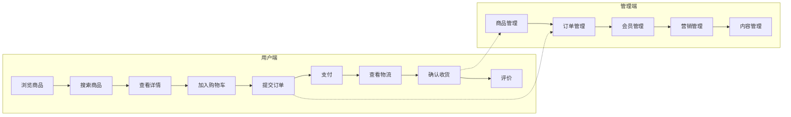

### 1.2 核心业务流程清单

| 序号 | 业务流程 | 复杂度 | 涉及模块 |
|------|----------|--------|----------|
| 1 | 用户登录注册 | 低 | ums |
| 2 | 商品浏览与搜索 | 中 | pms, es |
| 3 | 购物车管理 | 中 | cart |
| 4 | 订单创建与支付 | 高 | oms, payment |
| 5 | 订单发货与物流 | 中 | oms |
| 6 | 退货退款 | 高 | oms |
| 7 | 优惠券领取使用 | 中 | sms |
| 8 | 秒杀活动 | 高 | sms |
| 9 | 商品审核 | 低 | pms |
| 10 | 数据统计 | 中 | statistics |

---

## 二、用户模块业务流程

### 2.1 用户登录流程

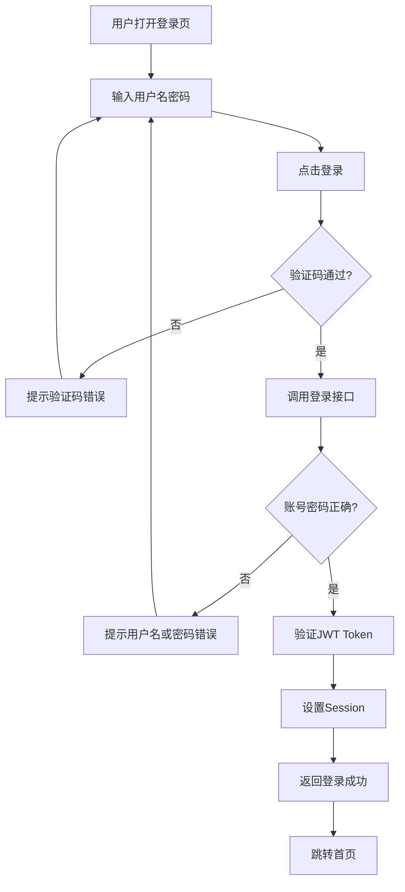

**关键接口**：

| 接口 | 方法 | 说明 |
|------|------|------|
| /admin/login | POST | 管理员登录 |
| /admin/logout | POST | 登出 |
| /admin/info | GET | 获取当前用户信息 |

### 2.2 权限校验流程

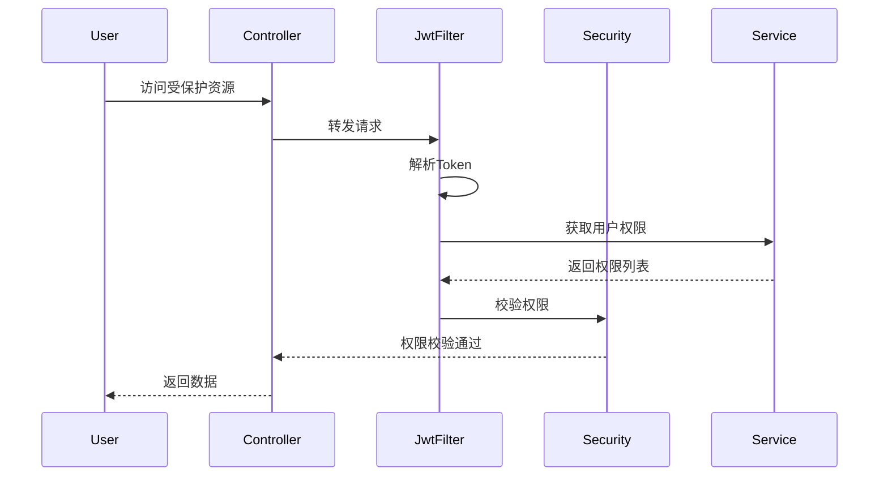

---

## 三、商品模块业务流程

### 3.1 商品管理流程

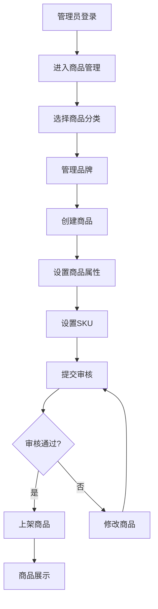

**商品状态流转**：

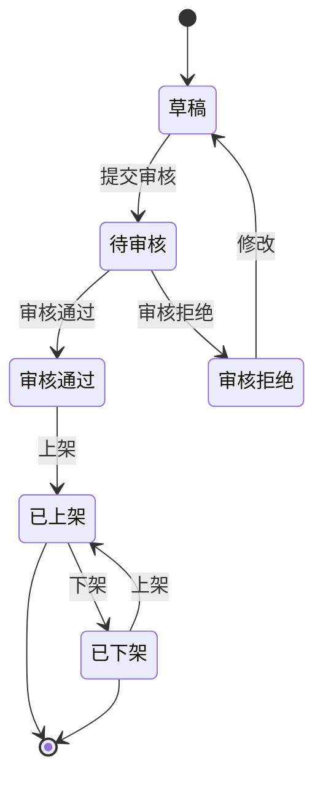

### 3.2 商品搜索流程 (ES)

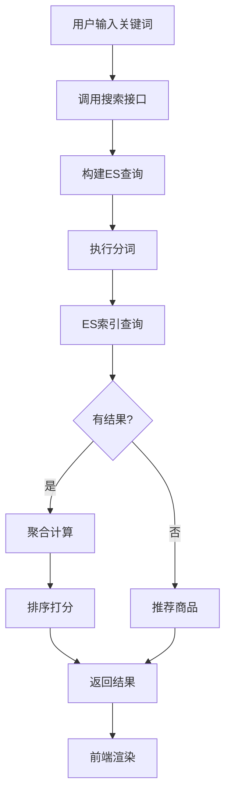

**搜索接口**：

| 接口 | 方法 | 说明 |
|------|------|------|
| /search | GET | 关键词搜索 |
| /search/aggregate | GET | 聚合查询 |

---

## 四、购物车业务流程

### 4.1 购物车流程

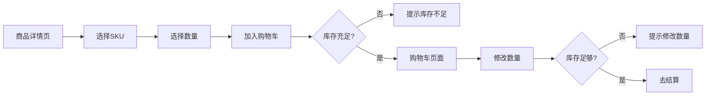

**购物车接口**：

| 接口 | 方法 | 说明 |
|------|------|------|
| /cart/add | POST | 添加商品 |
| /cart/list | GET | 购物车列表 |
| /cart/update | POST | 修改数量 |
| /cart/delete | DELETE | 删除商品 |

---

## 五、订单业务流程

### 5.1 订单创建流程

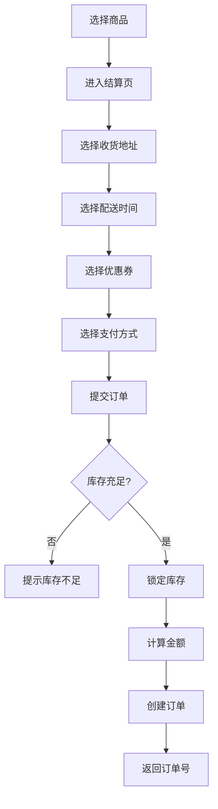

### 5.2 订单状态流转

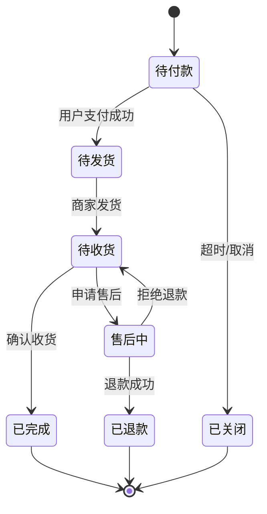

### 5.3 订单发货流程

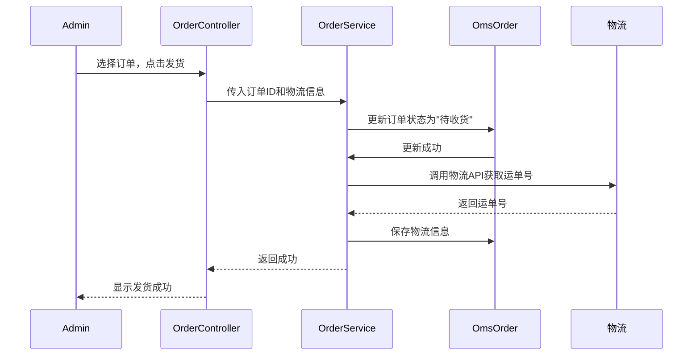

### 5.4 订单接口

| 接口 | 方法 | 说明 |
|------|------|------|
| /order/create | POST | 创建订单 |
| /order/list | GET | 订单列表 |
| /order/{id} | GET | 订单详情 |
| /order/delivery | POST | 发货 |
| /order/close | POST | 关闭订单 |
| /order/cancel | POST | 取消订单 |
| /order/delete | POST | 删除订单 |

---

## 六、退货退款流程

### 6.1 退货流程

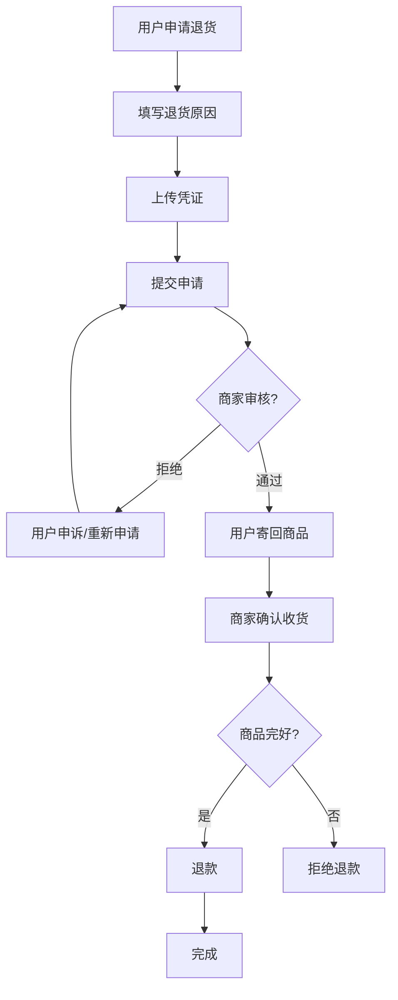

### 6.2 退款接口

| 接口 | 方法 | 说明 |
|------|------|------|
| /returnApply/list | GET | 退货申请列表 |
| /returnApply/{id} | GET | 退货详情 |
| /returnApply/confirm | POST | 确认收货 |
| /returnApply/reject | POST | 拒绝申请 |

---

## 七、营销模块业务流程

### 7.1 优惠券流程

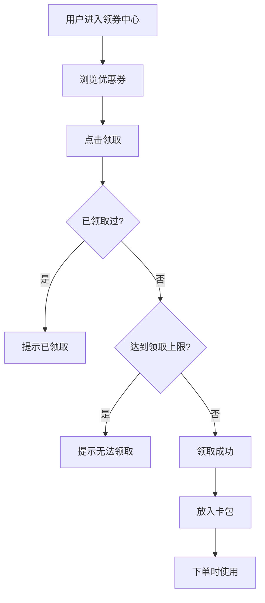

### 7.2 秒杀流程

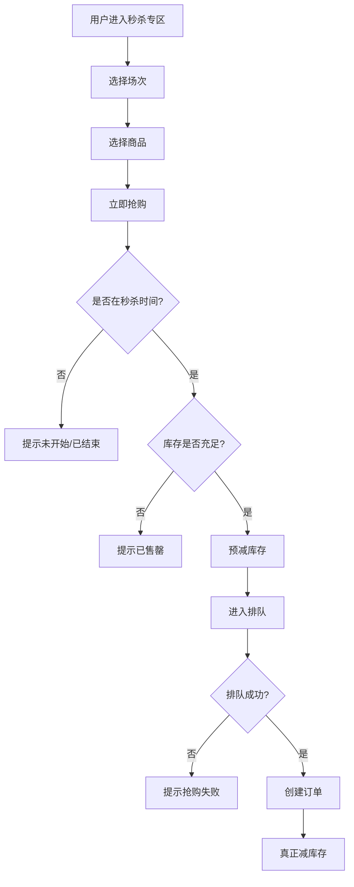

### 7.3 营销接口

| 接口 | 方法 | 说明 |
|------|------|------|
| /coupon/list | GET | 优惠券列表 |
| /coupon/{id} | GET | 优惠券详情 |
| /coupon/add | POST | 领取优惠券 |
| /flashPromotion/list | GET | 秒杀活动列表 |
| /flashSession/list | GET | 秒杀场次 |

---

## 八、数据同步流程

### 8.1 商品数据同步 (MySQL -> ES)

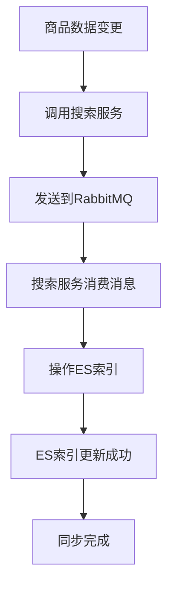

### 8.2 库存同步流程

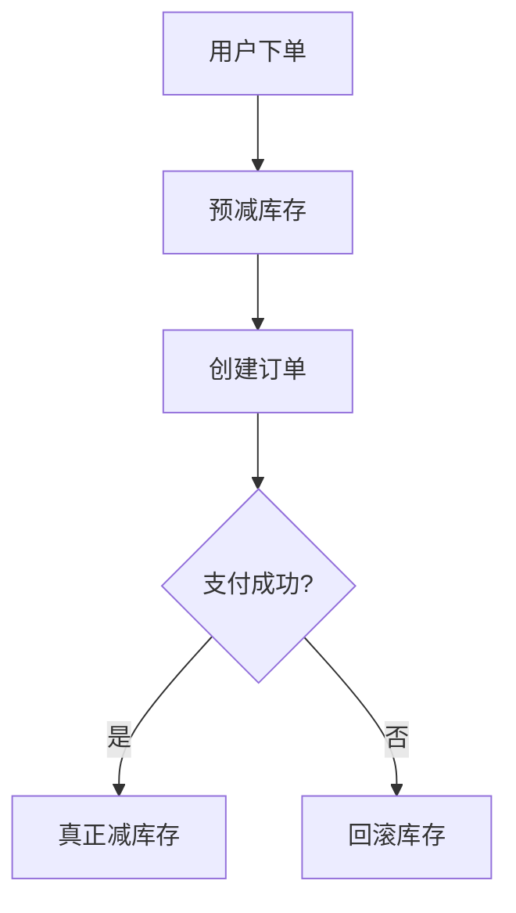

---

## 九、支付流程

### 9.1 支付流程

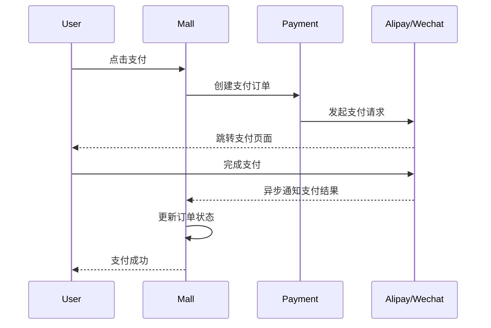

---

## 十、关键业务规则

### 10.1 订单超时规则

| 场景 | 超时时间 | 处理方式 |
|------|----------|----------|
| 待付款 | 30分钟 | 自动关闭，释放库存 |
| 待收货 | 15天 | 自动确认收货 |
| 待评价 | 7天 | 自动好评 |

### 10.2 库存扣减规则

```java
// 伪代码
public boolean deductStock(Long skuId, Integer quantity) {
    // 1. 检查库存
    PmsSkuStock sku = skuDao.selectById(skuId);
    if (sku.getStock() < quantity) {
        return false; // 库存不足
    }

    // 2. 预扣库存 (乐观锁)
    int result = skuDao.deductStock(skuId, quantity);
    return result > 0;
}
```

### 10.3 价格计算规则

```
订单金额 = 商品总价 + 运费 - 优惠(优惠券 + 积分)
实际支付 = 订单金额 - 抵扣(积分)
```

---

## 十一、可逆生成指南

> 基于本文档可以理解业务逻辑并重建相关功能：

1. **按模块开发**：先开发用户模块，再开发商品，最后订单
2. **状态机实现**：每个业务流程都有明确的状态流转，按状态机实现
3. **接口对应**：每个流程都有对应的 Controller 接口，按接口文档实现

**核心开发顺序**：
1. ums（用户模块）→ 权限基础
2. pms（商品模块）→ 核心业务
3. oms（订单模块）→ 交易闭环
4. sms（营销模块）→ 运营能力
